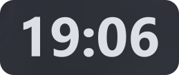
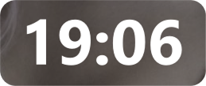

# WidgetClock

Минималистичные настольные часы для Windows, созданные на Python и PySide6.

Приложение отображается поверх всех окон и выглядит как виджет на рабочем столе.

[](LICENSE)


## Управление

* **ЛКМ** — перетаскивание окна
* **ПКМ** — контекстное меню:

  * выбор темы
  * добавить в автозагрузку
  * удалить из автозагрузки
  * выход

## Установка

### 1. Клонирование проекта

```bash
git clone https://github.com/king-tri-ton/WidgetClock.git
cd WidgetClock
```

### 2. Создание виртуального окружения

```bash
python -m venv venv
```

### 3. Активация виртуального окружения

```bash
venv\Scripts\activate
````

### 4. Установка зависимостей

```bash
pip install -r requirements.txt
```

### 5. Запуск

```bash
python app.py
```

## Темы оформления

### Titan (Dark)

Тёмная тема по умолчанию, подходит для постоянной работы.



---

### Paper (Light)

Светлая тема для дневного освещения.


---

### Cyberpunk

Яркий неоновый стиль с контрастными цветами.


---

### Glass Effect

Полупрозрачный «стеклянный» эффект.



## Автозагрузка

Через контекстное меню можно:

* добавить приложение в автозагрузку Windows
* удалить его из автозагрузки

Используется стандартный механизм Windows — создание `.lnk` ярлыка в папке Startup, без сторонних библиотек.

## Конфигурация

Основные параметры находятся в начале файла:

```python
USER_CONFIG = {
    "W": 210,
    "H": 90,
    "FONT_SIZE": 48,
    "PADDING_TOP": 0,
    "RADIUS": 15,
    "FONT_NAME": "Segoe UI Variable Display",
}
```

Можно менять размеры окна, шрифт, отступы и скругление под себя.

## Назначение проекта

Часы сделаны для рабочего компьютера, где важно:

* всегда видеть текущее время
* не занимать место на экране
* не отвлекаться на лишний интерфейс

---

## Контакты

По вопросам и предложениям:

* Telegram: [@king_tri_ton](https://t.me/king_tri_ton)
* Email: [mdolmatov99@gmail.com](mailto:mdolmatov99@gmail.com)
* или создавайте issues

---

by **King Triton**
